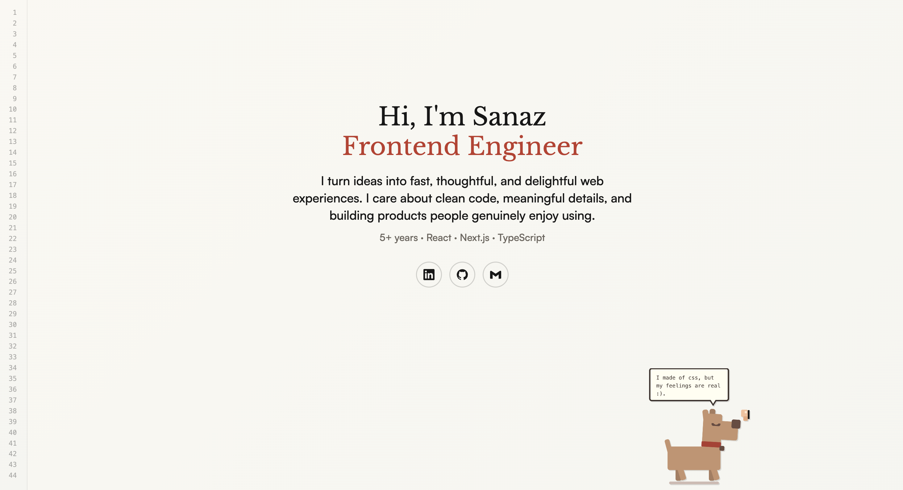

# Sanaz Javadi — Frontend Engineer Portfolio

A personal portfolio built to feel as clean and intentional as the products I build. Minimal layout, typographic focus, and a pixel-art dog walking across the bottom, because good work should also be a little fun.



## About

This is my personal corner of the web. I'm a frontend engineer with 5+ years of experience building fast, thoughtful web products with React, Next.js, and TypeScript. The site reflects how I approach code: structured, clean, and with care for every small detail.

Features:

- Pixel-art dog built entirely with pure CSS, no images, no canvas, just divs and keyframes, with a typewriter speech bubble
- Code-editor gutter aesthetic with line numbers
- Smooth social links (LinkedIn, GitHub, Email)
- Fully responsive

## Stack

| Tool            | Purpose             |
| --------------- | ------------------- |
| Vite + React 18 | Framework & bundler |
| TypeScript      | Type safety         |
| SCSS + BEM      | Styling             |
| Vercel          | Deployment          |

## Project Structure

```
src/
  constants/
    gutterLines.ts          # line numbers for the gutter
    socialLinks.tsx         # social link data + icons
    typewriterSentences.ts  # dog speech bubble text
  components/
    Hero/                   # main hero section
    Dog/                    # walking pixel dog + speech bubble
  hooks/
    useTypewriter.ts        # typing animation hook
```

## Run locally

```bash
npm install
npm run dev
```

## Build

```bash
npm run build
```

---

Designed & built by [Sanaz Javadi](https://www.linkedin.com/in/sanaz-javadi)
